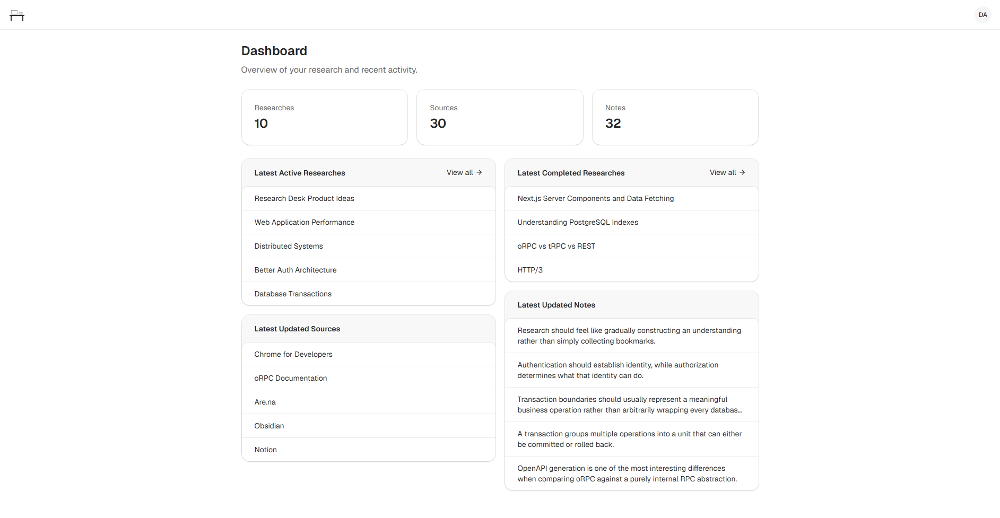
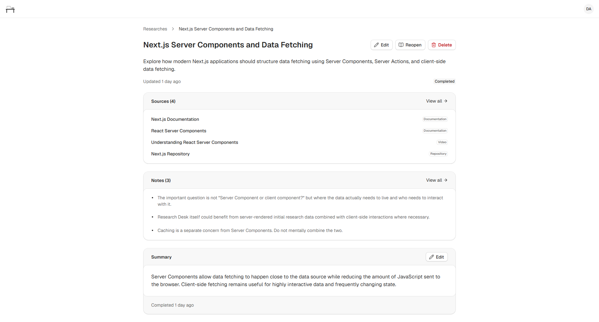
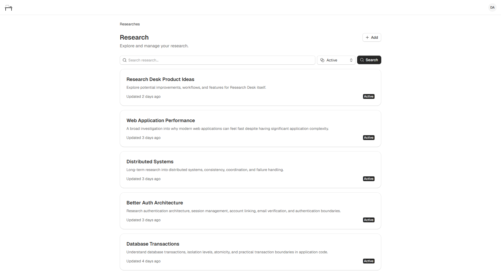
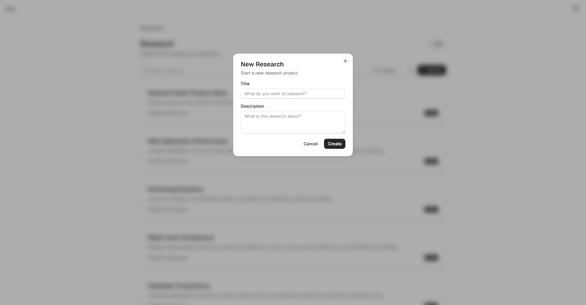

<!-- markdownlint-disable MD033 -->

# Research Desk

> A focused research workspace for turning a question into an organized collection of sources, notes, and conclusions.

A small full-stack application built with Next.js, TypeScript, PostgreSQL, and Prisma.

**[Live Demo](https://research-desk-mu.vercel.app)**

## Overview

Research Desk helps users investigate a question or subject by collecting relevant sources, writing notes while researching, and recording their final understanding.

The core workflow is:
**Question → Sources → Notes → Summary**

Instead of simply collecting bookmarks, Research Desk is designed to represent the research process itself—from the initial question through the final conclusion.

## Preview

### Dashboard

<picture>
  <source
    media="(prefers-color-scheme: dark)"
    srcset="./screenshots/dashboard-dark.png"
  />
  <source
    media="(prefers-color-scheme: light)"
    srcset="./screenshots/dashboard-light.png"
  />
  
</picture>

### Research

<picture>
  <source
    media="(prefers-color-scheme: dark)"
    srcset="./screenshots/research-detail-dark.png"
  />
  <source
    media="(prefers-color-scheme: light)"
    srcset="./screenshots/research-detail-light.png"
  />
  
</picture>

### Research List

<picture>
  <source
    media="(prefers-color-scheme: dark)"
    srcset="./screenshots/research-list-dark.png"
  />
  <source
    media="(prefers-color-scheme: light)"
    srcset="./screenshots/research-list-light.png"
  />
  
</picture>

### Create Research

<picture>
  <source
    media="(prefers-color-scheme: dark)"
    srcset="./screenshots/create-research-dark.png"
  />
  <source
    media="(prefers-color-scheme: light)"
    srcset="./screenshots/create-research-light.png"
  />
  
</picture>

## Features

- Create and manage research
- Collect sources used during research
- Organize sources by type
- Write and edit research notes
- Optionally associate notes with their source
- Search research and sources
- Filter research by status
- Write a final research summary
- Mark research as completed
- Authentication and user-owned data
- Responsive interface with loading, empty, and error states

## Tech Stack

- **Next.js** — application framework and App Router
- **React** — user interface
- **TypeScript** — type safety
- **PostgreSQL** — relational database
- **Prisma 7** — database access and ORM
- **Better Auth** — authentication
- **Zod** — input validation
- **Tailwind CSS** — styling
- **coss/ui** — UI components
- **Lucide** — icons

## Core Domain

Research Desk is intentionally built around a small domain:

```text
User
 │
 └── Research
       │
       ├── Source
       │
       └── Note
              │
              └── Source (optional)
```

A **Research** represents a question or subject being investigated.

A **Source** represents a resource used during that research, such as documentation, an article, video, repository, or paper.

A **Note** records something learned or observed during the investigation and may optionally reference the source it came from.

The **Summary** records the user's final understanding once the research is complete.

## Development

Research Desk favors a simple architecture appropriate to its scope.

The application uses **Server Actions** for mutations and server-side behavior where appropriate. User-owned resources are scoped to the authenticated user, and inputs are validated with **Zod**.

The project intentionally avoids unnecessary abstractions and infrastructure that are not required by the product.

## Getting Started

### Prerequisites

- Node.js 24+
- pnpm
- PostgreSQL

### Installation

Clone the repository and install dependencies:

```bash
pnpm install
```

Create a local environment file:

```bash
cp .env.example .env
```

Configure the required environment variables, then initialize the database:

```bash
pnpm prisma migrate dev
```

Start the development server:

```bash
pnpm dev
```

The application will be available at `http://localhost:3000`.

### Environment Variables

The application requires configuration for the PostgreSQL database, authentication, and application settings.

Create a `.env` file in the project root by copying `.env.example`:

```bash
cp .env.example .env
```

Then configure the required values.

## Scope

Research Desk is intentionally a personal research application. V1 focuses on the core workflow of creating research, collecting sources, writing notes, and recording conclusions.

Features such as collaboration, sharing, AI assistance, browser extensions, and knowledge graphs are outside the current scope.

## Project Status

**V1 — Complete**
Research Desk was built as a portfolio project to demonstrate the ability to take a bounded full-stack product from concept through implementation, deployment, and documentation.

## License

This project is built as a portfolio application.
